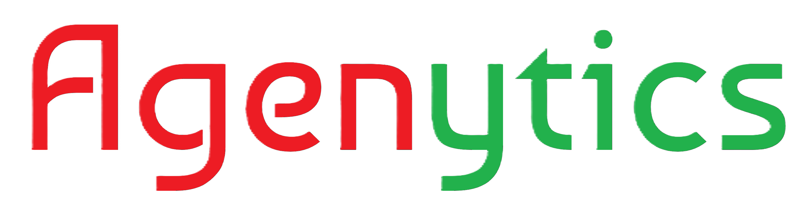
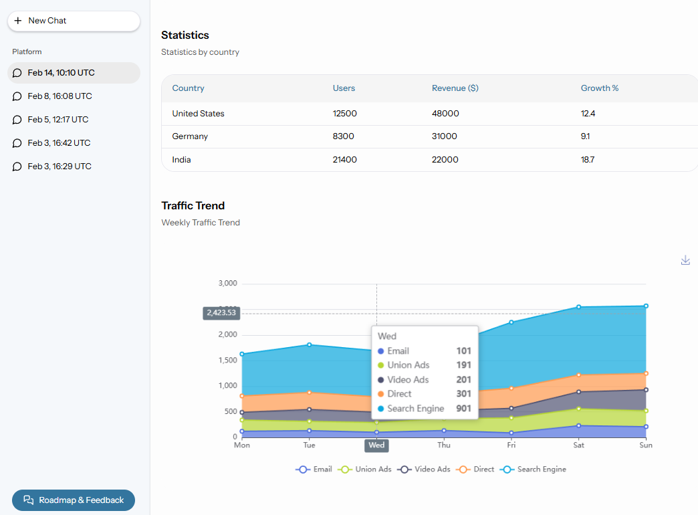

<div align="center"></div>

<h1 align="center">Agenytics Desktop</h1>

<p align="center">AI agent chat, packaged as a native Windows desktop app.</p>



This is a fork of [Agenytics](https://github.com/MuhammadQuran17/agenytics) (Laravel + Inertia + Vue). Two things changed from the original starter kit: the chat no longer talks to n8n, it talks to Google Gemini directly through the [Neuron AI](https://neuron-ai.dev/) PHP framework, and the app runs as a Windows desktop app via [NativePHP](https://nativephp.com/), not just in a browser. Stripe billing and the Feedback/Roadmap module got removed too — didn't need them here.

## AI chat

The chat job (`ProcessAiChatMessage`) calls `NeuronAiAgent`, which just hands the message off to a Neuron `Agent` class (`app/Neuron/Agents/BrowserAgent.php`) set up with Gemini as the provider. The response comes back wrapped in the same block format the UI already expects (text, table, chart, mermaid, etc.) — see `config/ai_responses.php` for what that looks like.

This branch also gives the agent real browser access through [Playwright MCP](https://github.com/microsoft/playwright-mcp), so it can actually open pages and read them instead of just answering from what it already knows. It's kept off `main` for now since it needs Node.js at runtime and the desktop build doesn't bundle that.

### Setting up browser access

```bash
npm install
npx playwright install chromium
```

The agent doesn't spawn a browser per request — it talks to one persistent Playwright MCP server over HTTP, so the browser stays open across chat messages instead of closing after each answer. Start it once:

```bash
powershell -File start-playwright-mcp-server.ps1
```

(or just run `start-desktop-app.ps1` for the desktop app — it starts the MCP server itself if it isn't already running)

`BrowserAgent` connects to it at `PLAYWRIGHT_MCP_URL` (defaults to `http://localhost:8931/mcp`, see `config/services.php`). Two things had to be handled to make the persistent-browser part actually work:
- The MCP server pings its HTTP client every few seconds and closes the browser if it doesn't get an answer back. Our client doesn't answer pings, so `start-playwright-mcp-server.ps1` sets `PLAYWRIGHT_MCP_PING_TIMEOUT_MS=0` to turn that off.
- The model has a `browser_close` tool available by default and will happily call it once it's done answering. `BrowserAgent::tools()` excludes `browser_close` and `browser_tabs` so it can't close the shared session out from under the next request.

## Running it locally

```bash
composer install
npm install
cp .env.example .env
php artisan key:generate
touch database/database.sqlite
php artisan migrate
```

Add to `.env`:

```
NEURON_AI_PROVIDER=gemini
GEMINI_KEY=your-key-from-aistudio.google.com/apikey
GEMINI_MODEL=gemini-flash-latest
IS_FAKE_RESPONSES_ENABLED=false
```

(leave `IS_FAKE_RESPONSES_ENABLED=true` if you just want to click around without a Gemini key)

```bash
composer dev
```

That starts the server, queue, logs and Vite together — go to `http://localhost:8000`.

## Running it as a desktop app

```bash
composer native:dev
```

Same app, opens in an Electron window instead of the browser. For an actual installer:

```bash
php artisan native:build win
```

Ran into two Windows-only issues getting this working, noting them here in case someone else hits the same thing:
- Electron would crash on boot with a weird `BrowserWindow` export error — turned out to be `ELECTRON_RUN_AS_NODE` being set in the environment (VS Code's terminal does this), which makes Electron run as plain Node instead of itself.
- The bundled PHP binary would fail with an OPcache/ASLR error on startup. Windows relocates the binary each run, which breaks OPcache's cached pointers for a statically-linked build. Fixed by pointing `PHPRC` at an ini file that disables opcache for it.

## Stack

Laravel 12, Inertia v2, Vue 3, SQLite, Tailwind v4, Neuron AI + Gemini, NativePHP.

## License

MIT — see [LICENSE](LICENSE.md).
